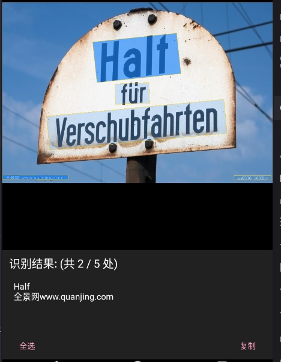

# CTPN_CRNN_BackEnd

+ Use [CTPN](https://github.com/eragonruan/text-detection-ctpn) (tf) to detect text regions of image 
+ Use [CRNN](https://github.com/meijieru/crnn.pytorch) (torch) to recognize text
+ Use [Flask](http://flask.pocoo.org/) to make restful api response

### Environment
+ [Colaboratory](https://colab.research.google.com/)
+ CTPN
    + `tensorflow` 1.14.0
    + `cv2` 3.4.3
    + others see [requirements.txt](https://github.com/eragonruan/text-detection-ctpn/blob/banjin-dev/requirements.txt)
+ CRNN
    + `pytorch` 1.1.0
    + `lmdb` 0.96
    + others see code
+ Server
    + `Flask` 1.0.2
    + `flask_cors` 3.0.8
    + `werkzeug` 0.14.1

### API
+ Document see [readme.md](https://github.com/Aoi-hosizora/CTPN_CRNN_BackEnd/blob/master/Server/readme.md)
+ Front-End(Android) see [OCRActivity.java](https://github.com/Aoi-hosizora/Biji_Baibuti/blob/Module-Note/app/src/main/java/com/baibuti/biji/UI/Activity/OCRActivity.java)

### Build
+ CTPN
    + Clone [text-detection-ctpn](https://github.com/eragonruan/text-detection-ctpn) repo into `CTPN/` and rename it to `ctpn_repo/`
    + Download the ckpt file(from `official repo`[https://github.com/eragonruan/text-detection-ctpn] backup) from [google drive](https://drive.google.com/file/d/1bnz4GOSuayUrHfxJuFGIhLncnLBaMfIz/view?usp=sharing) or [baidu yun](https://pan.baidu.com/s/1BNHt_9fiqRPGmEXPaxaFXw), Unzip `checkpoints_mlt.zip` at `ctpn_repo/`
    + Build cython lib

```bash
cd CTPN/
git clone https://github.com/eragonruan/text-detection-ctpn.git
mv text-detection-ctpn/ ctpn_repo/

# download checkpoints_mlt.zip
unzip checkpoints_mlt.zip

cd ctpn_repo/utils/bbox
chmod +x make.sh
./make.sh
```

+ CRNN
    + Download pretrained model(from [chineseocr repo](https://github.com/chineseocr/chineseocr)) from [google drive](https://drive.google.com/drive/folders/1VXMkdgdAXCKDu8DlYfma7Bt7lCb9IJT5?usp=sharing), move two pth files into `CRNN/models/`

+  <details>
    <summary>Structure</summary>
    <pre>
    .
    ├─assets/
    ├─CRNN/
    │  ├─data/
    │  └─models/
    ├─CTPN/
    │  └─ctpn_repo/
    │     ├─checkpoints_mlt/
    │     ├─data/
    │     │  ├─demo/
    │     │  ├─readme/
    │     │  ├─res/
    │     │  └─res_oriented/
    │     ├─main/
    │     ├─nets/
    │     └─utils/
    │         ├─bbox/
    │         ├─dataset/
    │         ├─prepare/
    │         ├─rpn_msr/
    │         └─text_connector/
    ├─Server/
    │  ├─Controllers/
    │  ├─Middleware/
    │  ├─Models/
    │  ├─Routes/
    │  └─Utils/
    │      └─Exception/
    └─tmp/
    </pre>
</details>

### Run Server
```bash
# After build and get model data
cd CTPN_CRNN_BackEnd/
python3 listen.py # Listen 0.0.0.0:1627
```

### Screenshot



### References
+ [chineseocr](https://github.com/chineseocr/chineseocr)
+ [text-detection-ctpn](https://github.com/eragonruan/text-detection-ctpn)
+ [crnn.pytorch](https://github.com/meijieru/crnn.pytorch)